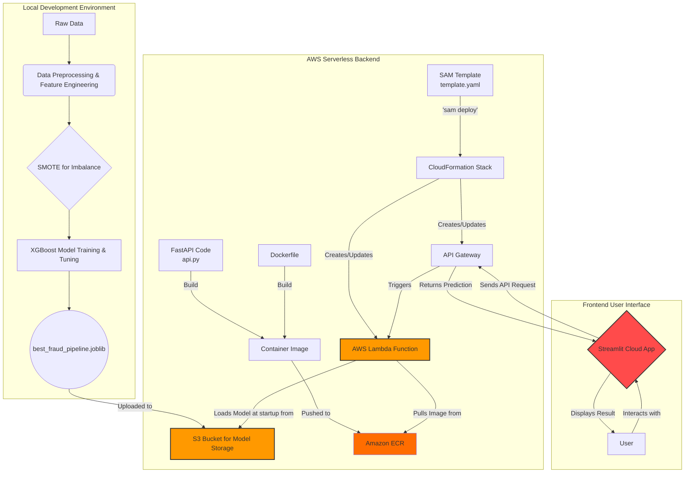

# Serverless Real-Time Fraud Detection API 🛡️

[](https://ino023h7ib.execute-api.ap-southeast-5.amazonaws.com/predict)
[](https://realtime-fraud-detection-api.streamlit.app/)
[](https://www.python.org/downloads/release/python-3110/)
[](https://opensource.org/licenses/MIT)

## 📋 Project Overview

This project implements an end-to-end real-time fraud detection system, featuring a machine learning model (XGBoost) exposed via a scalable serverless API on AWS. The system is demonstrated with an interactive web UI hosted on Streamlit Community Cloud. The primary goal was to build a production-mimicking solution while adhering to a strict **zero-cost objective** by leveraging AWS Free Tier services.

The system predicts whether a given financial transaction is fraudulent based on its features, providing both a classification and a probability score. This project covers the full MLOps lifecycle: data preprocessing, feature engineering, model training, robust API development (FastAPI), serverless deployment (AWS Lambda, SAM), and building a user-friendly demonstration interface (Streamlit).

## ✨ Live Demo & API Endpoint

- **🚀 Interactive Web App (Streamlit Cloud):** [**https://realtime-fraud-detection-api.streamlit.app/**](https://realtime-fraud-detection-api.streamlit.app/)
- **⚙️ Live API Endpoint (AWS Lambda):** [**https://ino023h7ib.execute-api.ap-southeast-5.amazonaws.com/predict**](https://ino023h7ib.execute-api.ap-southeast-5.amazonaws.com/predict)

**(Insert a screenshot or GIF of your final Streamlit application in action here!)**
<!-- Example:  -->

## 🏗️ System Architecture

The system integrates local ML development with a cloud-native serverless backend and a web-based frontend.



## ⭐ Core Features

- **Real-Time Fraud Prediction:** Classifies transactions as fraudulent or legitimate and provides a probability score.
- **Serverless & Scalable API:** Built with FastAPI and deployed on AWS Lambda for high scalability and cost-efficiency.
- **Containerized Deployment:** Uses Docker and Amazon ECR to manage dependencies and ensure environment consistency, overcoming Lambda's size limits.
- **Efficient Model Handling:** The trained model artifact is stored in S3 and loaded by the Lambda function at initialization.
- **Interactive Demo:** A publicly accessible Streamlit app showcases live API interaction.
- **Model Explainability (EC2 Version):** A temporary, full-featured version was deployed to an EC2 VM to demonstrate SHAP-based feature importance.
- **Zero-Cost for Production:** Designed to operate entirely within the AWS Free Tier and Streamlit Community Cloud's free hosting.

## 🛠️ Technology Stack

| Category | Technologies Used |
|----------|------------------|
| **Data Science & ML** | Python 3.11, Pandas, NumPy, Scikit-learn, XGBoost, Imbalanced-learn (SMOTE), Joblib, SHAP |
| **API Development** | FastAPI, Pydantic, Mangum (for Lambda) |
| **Cloud & Deployment** | AWS (Lambda, API Gateway, S3, ECR, SAM, CloudFormation, IAM), Docker, Streamlit Community Cloud, AWS EC2 (for dev demo) |
| **Version Control** | Git & GitHub |

## 📁 Project Structure

```
realtime-fraud-detection-api/
├── .git/
├── p1env/                     # Python virtual environment (in .gitignore)
├── fraud_api_lambda/          # Source code for the Lambda function
│   ├── api.py                 # FastAPI application script (loads model from S3)
│   ├── Dockerfile             # Dockerfile for the Lambda container image
│   └── requirements.txt       # Python dependencies for the Lambda function
├── streamlit_app_cloud/       # Source for the permanent Streamlit Cloud demo
│   ├── streamlit_cloud_demo.py# The API-only Streamlit app script
│   └── requirements.txt       # Minimal dependencies for the cloud app
├── .dockerignore
├── .gitignore
├── best_fraud_pipeline.joblib # The trained model artifact
├── demo.py                    # Script for the full demo (API + SHAP) on EC2
├── ec2_requirements.txt       # Dependencies for the full EC2 demo
├── requirements.txt           # Core project dependencies for local development
├── template.yaml              # AWS SAM template for serverless infrastructure
└── README.md                  # This file
```

## 🚀 Local Setup & Usage

### Prerequisites

- Git, Python 3.11, Docker Desktop
- An AWS account with the AWS CLI v2 and AWS SAM CLI installed and configured.

### Installation & Local Workflow

1. **Clone the Repository:**
   ```bash
   git clone https://github.com/amirulhazym/realtime-fraud-detection-api.git
   cd realtime-fraud-detection-api
   ```

2. **Set Up Virtual Environment:**
   ```bash
   python -m venv p1env
   .\p1env\Scripts\activate
   ```

3. **Install Dependencies:**
   ```bash
   pip install -r requirements.txt
   ```

4. **Run the ML Training Pipeline:** Execute the notebooks or scripts to train the model and generate `best_fraud_pipeline.joblib`.

5. **Test API Locally:** Modify a local version of `api.py` to load the model from the local file path instead of S3, then run `uvicorn api:app --reload`. Test endpoints at http://127.0.0.1:8000/docs.

## 🔧 Deployment Deep Dive

### AWS Serverless API

The API deployment was a key part of this project, involving a manual but robust workflow to handle large dependencies.

1. **Model Storage:** The final `best_fraud_pipeline.joblib` was uploaded to an AWS S3 bucket.
2. **Containerization:** The FastAPI application was containerized using the `fraud_api_lambda/Dockerfile`. This image was manually built and pushed to a private repository in Amazon ECR.
3. **Infrastructure as Code (IaC):** The `template.yaml` file defines all AWS resources. It specifies a Lambda function with `PackageType: Image` and points its `ImageUri` to the pre-pushed image in ECR. It also includes an IAM policy granting the Lambda function permission to read the model file from S3.
4. **Deployment:** The `sam deploy` command was used to execute the CloudFormation stack, provisioning the Lambda function, API Gateway, and all necessary IAM roles.

### Streamlit UIs

Two UIs were created to serve different purposes:

1. **EC2 Full Demo (Learning Exercise):** A full-featured version with SHAP explainability was deployed to an EC2 t3.micro instance. This taught valuable lessons in VM environment setup, dependency management on Linux, and troubleshooting. This instance was terminated to ensure zero ongoing cost.
2. **Streamlit Cloud Demo (Live Portfolio):** A lightweight, API-only version was created and deployed to the free Streamlit Community Cloud. This serves as the permanent, public-facing demo for the project.

## 💡 Key Challenges & Learnings

- **Overcoming Lambda Size Limits:** Successfully migrated from a simple ZIP deployment to a robust container-based deployment using ECR and S3 to handle the large model and dependency size.
- **Mastering AWS SAM for Containers:** Debugged and solved complex issues with the SAM CLI's automated image handling by adopting a more controlled manual docker build/push workflow, providing a deeper understanding of the underlying mechanics.
- **Robust EC2 Environment Setup:** Navigated and resolved numerous real-world VM setup challenges, including Linux package management, Python version conflicts, and pip installation failures due to temporary disk space limitations (solved by redirecting TMPDIR).
- **Cost-Driven Architecture:** The entire project was guided by a zero-cost principle for persistent components, leading to strategic choices like using the permanent Streamlit Cloud demo over a continuously running EC2 instance.

## 🔮 Future Enhancements

- **CI/CD Pipeline:** Fully automate the model retraining, ECR image push, and SAM deployment using GitHub Actions (as implemented in Project 2).
- **Advanced Monitoring:** Implement comprehensive CloudWatch dashboards and alarms for API performance, errors, and costs.
- **Security Hardening:** Refine the Lambda's IAM role to the principle of least privilege and add an API key to the API Gateway.

## 👤 Author

**Amirulhazym**

- LinkedIn: [linkedin.com/in/amirulhazym](https://linkedin.com/in/amirulhazym)
- GitHub: [github.com/amirulhazym](https://github.com/amirulhazym)
- Portfolio: [amirulhazym.framer.ai](https://amirulhazym.framer.ai)
